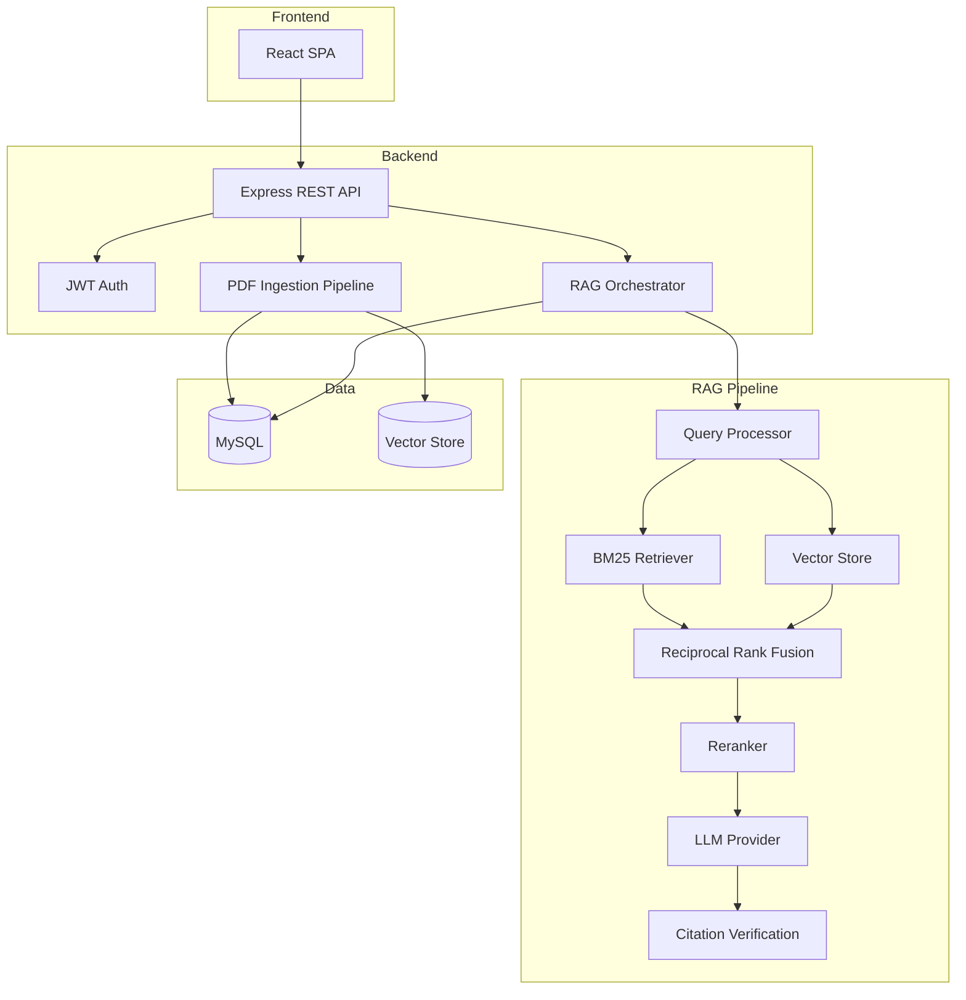

# Enterprise Document Intelligence

Production-grade Enterprise Document Intelligence / RAG application demonstrating real AI engineering skills.

> **New to this project?** See **[HOW_TO_RUN.md](./HOW_TO_RUN.md)** for a complete beginner step-by-step guide (VS Code + XAMPP + MySQL on Windows).

## Architecture



## Technology Stack

| Layer | Technology |
|-------|-----------|
| Frontend | React, Vite, React Router, Axios |
| Backend | Node.js, Express, JWT |
| Database | MySQL 8.0 |
| AI/RAG | Custom abstractions (EmbeddingProvider, VectorStore, KeywordRetriever, Reranker, LLMProvider) |
| DevOps | Docker, GitHub Actions |

## Quick Start

### Prerequisites

- Node.js 18+
- MySQL 8.0 (or Docker)

### Local Setup

```bash
# Clone and install
cd enterprise-document-intelligence
cp .env.example .env

# Start MySQL (Docker)
docker compose up mysql -d

# Install dependencies
npm run install:all

# Run migrations
npm run migrate

# Start backend (terminal 1)
npm run dev:backend

# Start frontend (terminal 2)
npm run dev:frontend
```

Open http://localhost:5173

### Docker (full stack)

```bash
docker compose up
```

## API Endpoints

| Method | Endpoint | Description |
|--------|----------|-------------|
| GET | `/api/v1/health/health` | Health check |
| GET | `/api/v1/health/ready` | Readiness check |
| POST | `/api/v1/auth/register` | Register user |
| POST | `/api/v1/auth/login` | Login |
| GET | `/api/v1/auth/me` | Current user |
| POST | `/api/v1/documents/upload` | Upload PDF |
| GET | `/api/v1/documents` | List documents |
| GET | `/api/v1/documents/:id/status` | Processing status |
| POST | `/api/v1/chat` | Chat with RAG |
| POST | `/api/v1/chat/feedback` | Submit feedback |

## RAG Pipeline

1. **PDF Ingestion** → text extraction → chunking → embedding → indexing
2. **Query Processing** → normalization → conversational rewriting (when needed)
3. **Hybrid Retrieval** → BM25 + Vector search → Reciprocal Rank Fusion
4. **Reranking** → cross-encoder style scoring → top-K selection
5. **Generation** → grounded LLM answer with strict abstention
6. **Citation Verification** → validate citations against retrieved chunks

## Environment Variables

See `.env.example` for all configuration options.

Key variables:
- `OPENAI_API_KEY` — enables OpenAI embeddings/LLM (mock providers used without it)
- `JWT_SECRET` — JWT signing secret
- `DB_*` — MySQL connection settings

## Evaluation

```bash
npm run evaluate
npm run evaluate -- --mode=hybrid
```

Metrics: Recall@K, MRR, nDCG, faithfulness, abstention accuracy, citation correctness.

## Testing

```bash
npm test
```

## Project Structure

```
enterprise-document-intelligence/
├── frontend/          # React SPA
├── backend/           # Express API + RAG engine
├── database/          # SQL migrations
├── evaluation/        # RAG evaluation framework
├── docs/              # Documentation
├── scripts/           # Utility scripts
├── infrastructure/    # Deployment configs
└── .github/workflows/ # CI/CD
```

## Security

- JWT authentication with bcrypt password hashing
- Document-level access control (owner + permissions + admin)
- Rate limiting, helmet, CORS
- Input validation on all endpoints
- API keys never exposed to frontend

